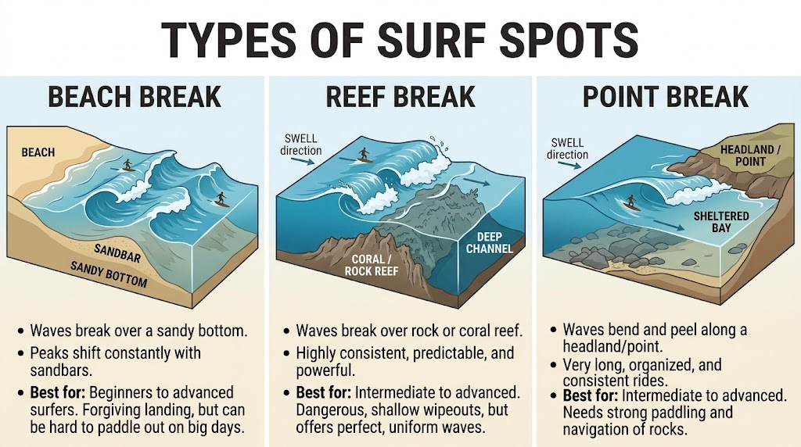
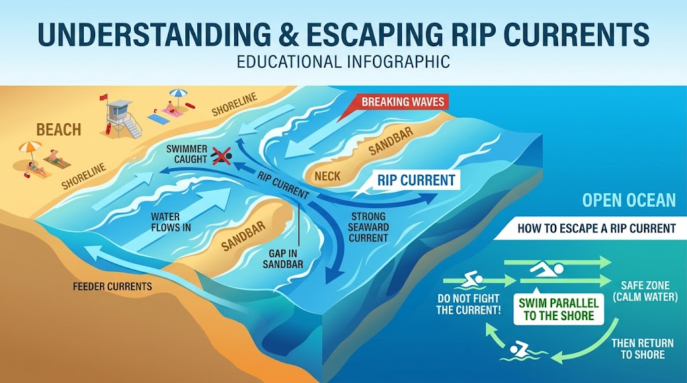
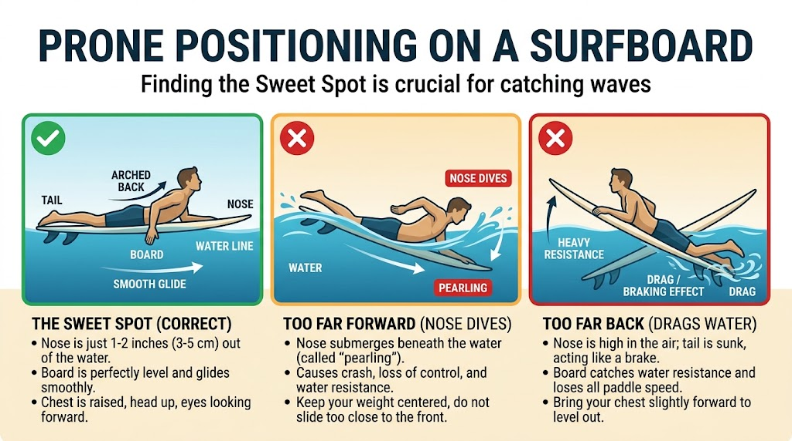
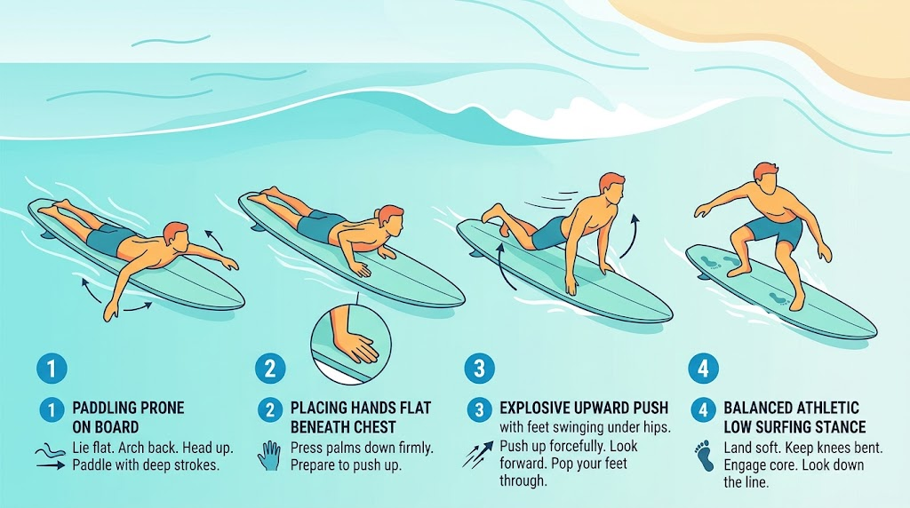
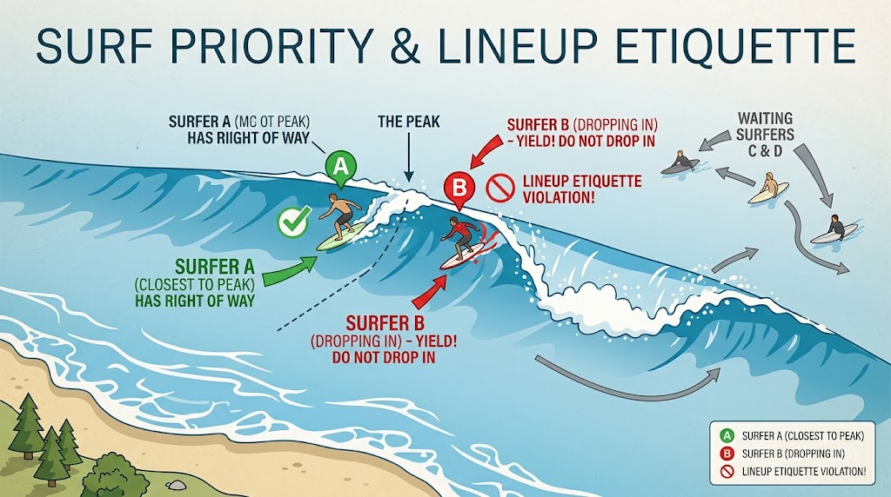
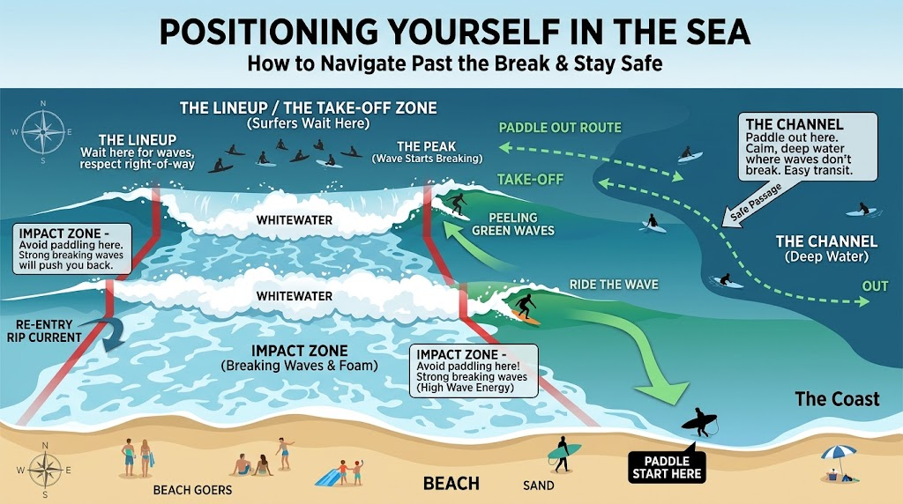

# 🏄 The Complete Surfing Guide: From Zero to Flow

A practical, no-fluff guide to surfing — from understanding the ocean and staying safe, to your first pop-up, to carving turns on a shortboard. Written to be read top to bottom as a beginner, or used as a reference once you're out in the water.

> 📸 **Note on images:** Most diagrams below are illustrations built for this guide. If you have real photos or video stills (rip currents at your local beach, your own pop-up sequence, lineup shots), drop them into `images/` and swap the links in — real footage always beats a diagram.

## Table of Contents

1. [Ocean Knowledge & Safety](#module-1-ocean-knowledge--safety-the-non-negotiables)
2. [Gear Essentials](#module-2-gear-essentials)
3. [Level 1 — Beginner: Whitewater & First Pop-Up](#module-3-level-1--the-beginner-whitewater--first-pop-up)
4. [Lineup Etiquette & Right of Way](#module-4-lineup-etiquette--right-of-way)
5. [Level 2 — Intermediate: Green Waves & Angled Take-Offs](#module-5-level-2--the-intermediate-green-waves--angled-take-offs)
6. [Level 3 — Advanced: Speed, Trimming & Turns](#module-6-level-3--the-advanced-speed-trimming--turns)
7. [Fitness & Injury Prevention](#module-7-fitness--injury-prevention)
8. [Progression Roadmap](#module-8-progression-roadmap)
9. [Glossary](#glossary)
10. [Pre-Session Checklist](#quick-pre-session-checklist-save--share)

---

## Module 1: Ocean Knowledge & Safety (The Non-Negotiables)

Before touching a surfboard, learn to read the playing field. The ocean is dynamic, powerful, and demands respect — most surfing injuries and near-misses come from misreading conditions, not from bad technique.

### 1. How Waves Work

**Swell & Period**
Swells are generated by distant storms out at sea and travel as organized energy across the ocean. The **swell period** (time in seconds between wave crests) tells you how powerful a wave will be:

- **12–16+ seconds** — long-period groundswell. Fast, powerful, well-organized waves that have traveled far and consolidated energy.
- **8–10 seconds** — shorter-period wind swell. Weaker, choppier, and less consistent, but perfectly fine for learning.

**Wind Conditions**

| Wind Direction | Effect |
|---|---|
| **Offshore** (blowing from land to sea) | Best conditions. Grooms the wave face smooth and holds the lip up longer, creating cleaner, more hollow waves. |
| **Onshore** (blowing from sea to land) | Choppy and messy. Waves crumble early and lose shape. |
| **Cross-shore** | Adds drift and chop. Manageable, but requires constant repositioning in the lineup. |

**Tides**
- **High tide** generally fills bays with deeper water — waves can become mushy, or you get shore-break dumping close to the sand.
- **Low tide** exposes reefs and sandbanks, creating faster, shallower, and hollower waves (and more hazard on shallow reef spots).
- Check a local tide chart and combine it with the spot's personality — every break has a tide it likes best. Ask locally or check surf forecast sites for your spot.

### 2. Spot Types

- **Beach Break** — Waves break over shifting sandbanks. Great for learning since peaks move and there's usually somewhere less crowded, but the shifting sand means peaks aren't fixed session to session.
- **Point Break** — Waves peel along a headland or stretch of coastline in one direction, offering long, predictable rides. Usually gets crowded because good ones are rare.
- **Reef Break** — Waves break over a rock or coral reef. The bottom doesn't move, so the take-off zone is consistent and predictable — but the trade-off is a shallow, hazardous bottom. Not for beginners.

### 3. Rip Currents & How to Escape

Rip currents are narrow, fast-flowing channels of water moving seaward, away from the shore. They form where funneled water from breaking waves finds the quickest way back out to sea. They commonly look like calm, darker, or churned-up gaps between the breaking whitewater on either side — deceptively inviting because the water looks flatter.

- **Rule #1:** Never fight the current directly back to shore. Rips don't pull you under, they pull you out — but swimming straight against one will exhaust you long before you make progress.
- **Rule #2:** Stay calm, float, and swim/paddle **parallel to the beach** across the rip until you're clear of it, then let the whitewater on either side push you back toward the sand. Most rips are only 10–30 meters wide.
- If you can't escape it, don't panic — rips dissipate a short distance offshore. Signal for help by raising an arm if you're in trouble, and conserve energy by floating.

---

## Module 2: Gear Essentials

| Item | What to Choose | Key Tip |
|---|---|---|
| **Board** | **Beginner:** Foamie / soft-top, 8'0"–9'0", 70–90L volume. **Intermediate:** Funboard / mini-mal, 7'2"–8'0". **Advanced:** Shortboard / fish / performance, 5'8"–6'4". | Volume is your friend — more volume means easier paddling and catching far more waves. Don't downsize until you're consistently taking off late and turning, not just standing up. |
| **Leash** | Match leash length roughly to board length (an 8ft board needs an 8ft leash). | Attach firmly below the knee/ankle, with the rail-saver strap protecting the tail from wear. |
| **Wetsuit** | 2mm (warm / spring), 3/2mm (mild, ~15–19°C), 4/3mm or 5/4mm + boots/hood (cold, <14°C). | Must fit snug with zero pocketing of loose fabric — a baggy suit fills with water and gets heavy and cold. |
| **Fins** | Beginner: soft, flexible fins for stability. Advanced: stiffer, smaller fins for responsiveness. | Thruster (3-fin) setups are the most common all-rounder; quads add speed down the line, singles add hold and flow. |
| **Wax** | Basecoat on bare decks, topcoat matched to local water temp (cold, cool, warm, tropical). | Cross-hatch application creates grippy bumps rather than a slick smear — don't just circle in one spot. |
| **Sun protection** | Rash guard or wetsuit top, zinc or reef-safe sunscreen. | You burn faster on the water from reflection off the surface — reapply after every session longer than an hour. |

---

## Module 3: Level 1 — The Beginner (Whitewater & First Pop-Up)

The primary goal here is learning trim, paddle speed, and committing to a clean pop-up in the whitewater (the reformed foam after a wave breaks) before ever worrying about unbroken waves.

### 1. Prone Positioning & the Sweet Spot

- Lie centered along the stringer (the board's middle line).
- If your nose sinks under water (**pearling**), you're too far forward.
- If your tail sinks and drags water behind you, you're too far back.
- Arch your chest slightly upward, eyes looking ahead — not down at the deck.

### 2. The Pop-Up Mechanics

1. **Paddle with intent** — 4 to 6 strong, deep crawl strokes until the whitewater catches and pushes you.
2. **Hand placement** — palms flat on the deck right next to your lower ribs/chest. Never grab the rails; grabbing tips the board off balance.
3. **Explosive press** — press up cleanly while driving your hips upward, creating space underneath your torso for your feet to come through.
4. **Foot placement** — bring your back foot down over the fins, and swing your front foot directly into the space where your hands were.

**The Athletic Stance**
- Feet roughly shoulder-width apart, perpendicular to the stringer.
- Knees bent and springy; weight centered 50/50 between front and back foot.
- Torso upright, head and eyes focused down the line — not at your feet.

### 3. Common Beginner Mistakes

- **Standing up in stages** (knees first, then hands) instead of one fluid motion — this is slower and less stable.
- **Looking down** at your feet during the pop-up, which pulls your weight forward and pearls the nose.
- **Paddling too late** — you need speed *before* the wave arrives, not after it's already passing you.
- **Stiff arms/legs** — a locked stance can't absorb the board's movement; stay loose and bent.

---

## Module 4: Lineup Etiquette & Right of Way

Surfing has an unspoken code of conduct designed to keep everyone safe and avoid collisions. Learning it is as important as learning to pop up.

- **The peak has priority** — the surfer closest to the breaking curl/peak of the wave has the right of way.
- **Do not drop in** — if someone is already riding a wave from deeper inside, pull back immediately. Dropping in is dangerous and disrespectful, and is the single fastest way to get a reputation (or a collision) in the lineup.
- **Do not snake** — never paddle around behind someone who's already in position just to steal inside priority.
- **Paddling out** — go wide around the impact zone through the channel where waves aren't breaking. If you're caught in front of an oncoming surfer, paddle toward the whitewater side, leaving the open green face clear for them to ride.
- **Hold your board** — never ditch your surfboard when a wave approaches if anyone is behind or near you; a loose board is a projectile. Learn to turtle roll or duck dive instead.
- **Communicate** — a wave with two people going the same direction is safer if someone calls "going left/right" early, or one surfer calls off.

---

## Module 5: Level 2 — The Intermediate (Green Waves & Angled Take-Offs)

Moving out back to catch unbroken "green" waves is the biggest jump in the sport — everything happens faster and you need to read the wave before it breaks.

### 1. Getting Past the Impact Zone

- **Turtle roll** (longboards & soft-tops): flip upside down with the board above you underwater, holding the rails firmly near the nose, and let the whitewater roll past overhead before flipping back up.
- **Duck dive** (low-volume boards): push the nose deep under the oncoming wave with both hands, push the tail down with your back foot/knee, and let the wave pass overhead before resurfacing.

### 2. Reading the Wave & Angled Take-Off

- Identify the **peak** — the highest, steepest point where the wave will break first — and determine whether it's a **left** (peeling toward the surfer's left) or a **right** (peeling toward the surfer's right).
- Angle your board at roughly **30–45 degrees** in the direction the wave is peeling during your final paddle strokes. This sets your inside rail early and avoids straight bottom-plunging into the flat trough.

### 3. The Bottom Turn

- As you drop down the face, bend low through your knees and drive your weight into your inside rail (toeside or heelside).
- Open your leading shoulder toward the shoulder of the wave. A solid bottom turn converts all your drop speed into horizontal wall speed — it's the foundation every other maneuver is built from.

---

## Module 6: Level 3 — The Advanced (Speed, Trimming & Turns)

### 1. Generating Speed (Pumping)

Waves don't push you forever — you have to generate your own speed by moving between the upper third (the acceleration zone) and the lower flats.

- **Compression & extension** — compress your body entering the bottom of the wave, then decompress and extend your legs as you drive back up toward the high line. This "pumping" motion is how surfers generate speed on sections that would otherwise close out.

### 2. Core Maneuvers

- **The cutback** — when you outrun the pocket onto the flat shoulder, lean hard on your heels or toes to reverse direction 180 degrees back toward the breaking curl, where the energy lives.
- **Top turn / snap** — driving off the bottom turn straight up into the steep pocket or lip, releasing the tail through your hips and shoulders, then redirecting back down the face.
- **Floater** — riding up and over a closing section along the top of the breaking lip, then dropping back down onto the reformed wave.
- **Aerial** (advanced-advanced) — using a steep ramp section to launch the board off the wave entirely, requires significant speed and a committed, compact stance in the air.

---

## Module 7: Fitness & Injury Prevention

Surfing is demanding on the shoulders, lower back, and hip flexors. A little conditioning goes a long way toward more waves per session and fewer injuries.

- **Paddle endurance** — freestyle swimming or a paddleboard/prone paddleboard session builds the specific shoulder and lat endurance surfing demands.
- **Mobility** — hip openers, thoracic spine rotation, and ankle mobility all directly translate to a better pop-up and stance.
- **Core & lower back** — planks, bird-dogs, and back extensions protect against the chronic lower-back strain common in surfers from paddling in an arched position.
- **Cold-water safety** — know the signs of hypothermia (shivering, confusion, loss of coordination) and set a personal time limit in cold water regardless of how good the waves are.
- **Know your limits** — fatigue is when most incidents happen. If your arms are dead and you're getting caught inside repeatedly, it's time to come in.

---

## Module 8: Progression Roadmap

A rough guide to what "next" looks like — everyone progresses at a different pace, so use this as a checklist, not a deadline.

- [ ] Catch and ride whitewater to the beach, standing, multiple times in a session
- [ ] Consistent pop-up in one fluid motion, feet landing in the right spot
- [ ] Paddle out through small surf unassisted
- [ ] Turtle roll or duck dive successfully past breaking waves
- [ ] Catch your first unbroken green wave and complete an angled take-off
- [ ] Link a bottom turn into a controlled ride along the open face
- [ ] Perform a controlled cutback
- [ ] Perform a top turn / snap off the lip
- [ ] Comfortably surf a step-up board size or a more critical wave (reef/point)

---

## Glossary

- **Barrel/Tube** — the hollow, cylindrical part of a wave as it breaks over itself.
- **Close-out** — a wave that breaks all at once along its length rather than peeling, offering no rideable shoulder.
- **Inside** — the area closer to shore/the breaking part of the wave; also refers to positional priority ("she's more inside than you").
- **Kook** — a mildly derogatory term for an inexperienced or poorly-mannered surfer.
- **Line-up** — the area out back where surfers wait to catch waves.
- **Rail** — the edges of the surfboard, running from nose to tail.
- **Set** — a group of larger waves arriving together, usually followed by a lull.
- **Stringer** — the center support strip running down the length of a surfboard.
- **Take-off** — the moment and location where a surfer starts riding a wave.

---

## Quick Pre-Session Checklist (Save & Share)

- [ ] **Check conditions** — wind direction, tide height, swell period.
- [ ] **Check gear** — leash string secure, fins tight, proper wax applied.
- [ ] **5-minute shore watch** — locate the channel, identify rip currents, note where sets are breaking.
- [ ] **Warm-up** — 3 minutes of shoulder mobility, hip openers, and squat rotations.
- [ ] **Have fun & share waves** — respect the locals, follow priority, and keep safety first.

---

*Contributions welcome — if you have corrections, local knowledge, or photos/video to add, open a PR or issue.*
