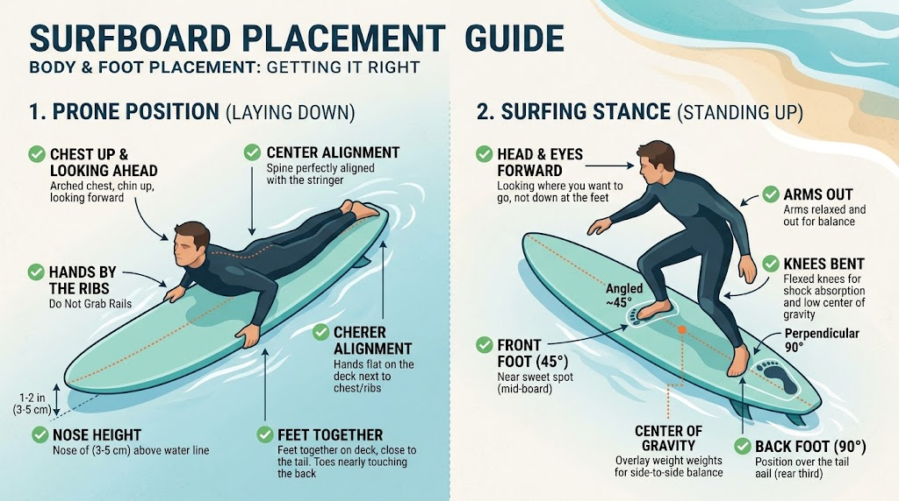
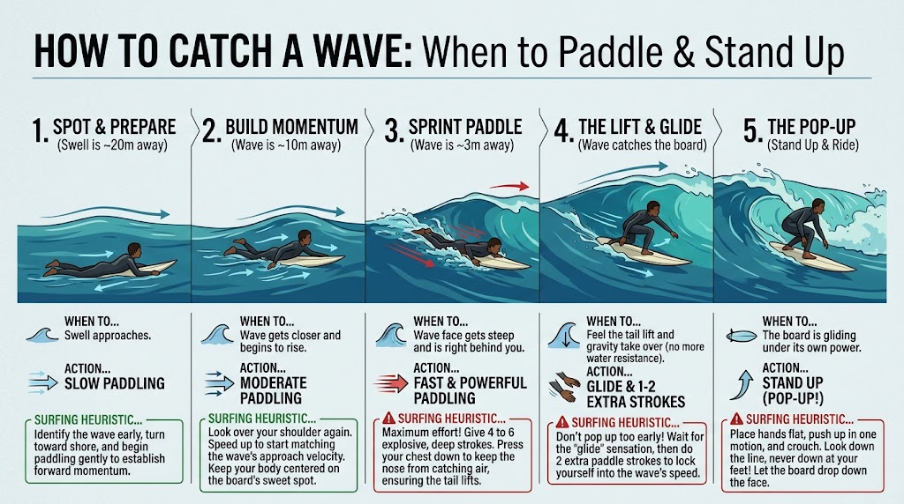
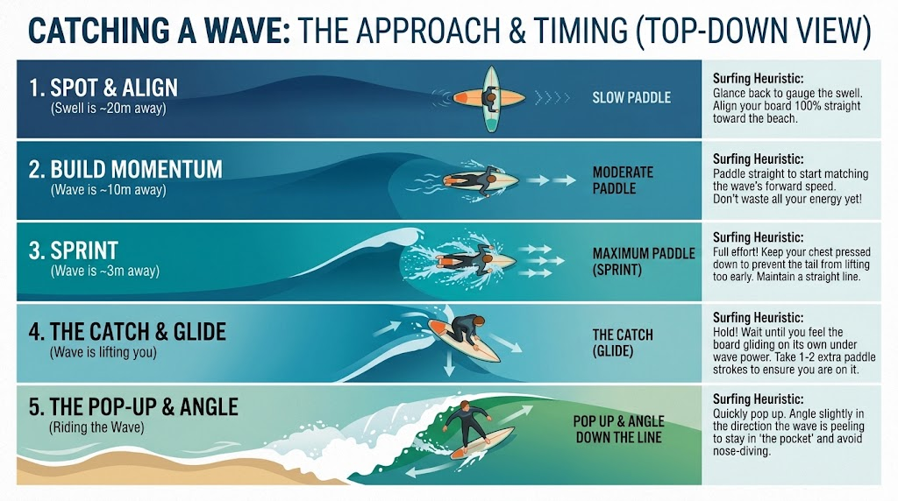
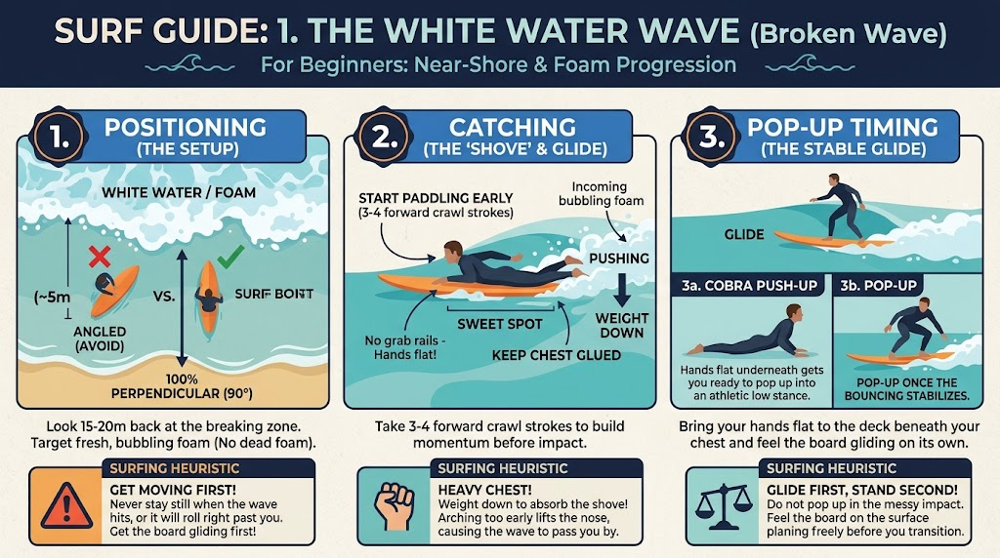
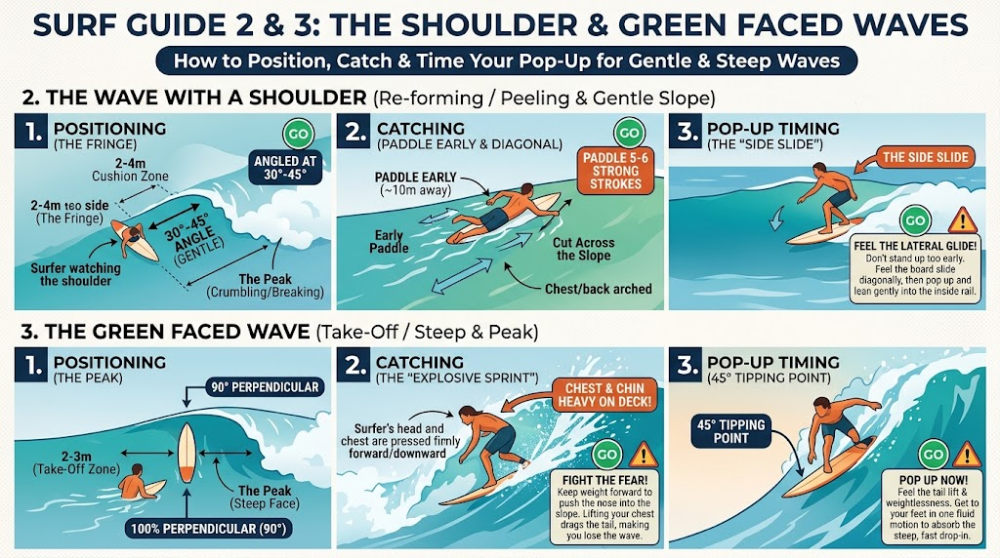

# 🏄 The Complete Surfing Guide: From Zero to Flow

A practical, no-fluff guide to surfing — from understanding the ocean and staying safe, to your first pop-up, to carving turns on a shortboard. Written to be read top to bottom as a beginner, or used as a reference once you're out in the water.

> 📸 **Note on images:** Most diagrams below are illustrations built for this guide. If you have real photos or video stills (rip currents at your local beach, your own pop-up sequence, lineup shots), drop them into `images/` and swap the links in — real footage always beats a diagram.

## Table of Contents

1. [Ocean Knowledge & Safety](#module-1-ocean-knowledge--safety-the-non-negotiables)
2. [Gear Essentials](#module-2-gear-essentials)
3. [Level 1 — Beginner: Whitewater & First Pop-Up](#module-3-level-1--the-beginner-whitewater--first-pop-up)
4. [Catching Waves by Type](#module-4-catching-waves-by-type)
5. [Lineup Etiquette & Right of Way](#module-5-lineup-etiquette--right-of-way)
6. [Level 2 — Intermediate: Green Waves & Angled Take-Offs](#module-6-level-2--the-intermediate-green-waves--angled-take-offs)
7. [Level 3 — Advanced: Speed, Trimming & Turns](#module-7-level-3--the-advanced-speed-trimming--turns)
8. [Fitness & Injury Prevention](#module-8-fitness--injury-prevention)
9. [Progression Roadmap](#module-9-progression-roadmap)
10. [Glossary](#glossary)
11. [Pre-Session Checklist](#quick-pre-session-checklist-save--share)

---

## Module 1: Ocean Knowledge & Safety (The Non-Negotiables)

Before touching a surfboard, learn to read the playing field. The ocean is dynamic, powerful, and demands respect — most surfing injuries and near-misses come from misreading conditions, not from bad technique.

### 1. How Waves Work

**Swell & Period**
Swells are generated by distant storms out at sea and travel as organized energy across the ocean. The **swell period** (time in seconds between wave crests) tells you how powerful a wave will be:

- **12–16+ seconds** — long-period groundswell. Fast, powerful, well-organized waves that have traveled far and consolidated energy.
- **8–10 seconds** — shorter-period wind swell. Weaker, choppier, and less consistent, but perfectly fine for learning.

**Wind Conditions**

| Wind Direction | Effect |
|---|---|
| **Offshore** (blowing from land to sea) | Best conditions. Grooms the wave face smooth and holds the lip up longer, creating cleaner, more hollow waves. |
| **Onshore** (blowing from sea to land) | Choppy and messy. Waves crumble early and lose shape. |
| **Cross-shore** | Adds drift and chop. Manageable, but requires constant repositioning in the lineup. |

**Tides**
- **High tide** generally fills bays with deeper water — waves can become mushy, or you get shore-break dumping close to the sand.
- **Low tide** exposes reefs and sandbanks, creating faster, shallower, and hollower waves (and more hazard on shallow reef spots).
- Check a local tide chart and combine it with the spot's personality — every break has a tide it likes best. Ask locally or check surf forecast sites for your spot.

### 2. Spot Types

- **Beach Break** — Waves break over shifting sandbanks. Great for learning since peaks move and there's usually somewhere less crowded, but the shifting sand means peaks aren't fixed session to session.
- **Point Break** — Waves peel along a headland or stretch of coastline in one direction, offering long, predictable rides. Usually gets crowded because good ones are rare.
- **Reef Break** — Waves break over a rock or coral reef. The bottom doesn't move, so the take-off zone is consistent and predictable — but the trade-off is a shallow, hazardous bottom. Not for beginners.

### 3. Rip Currents & How to Escape

Rip currents are narrow, fast-flowing channels of water moving seaward, away from the shore. They form where funneled water from breaking waves finds the quickest way back out to sea. They commonly look like calm, darker, or churned-up gaps between the breaking whitewater on either side — deceptively inviting because the water looks flatter.

- **Rule #1:** Never fight the current directly back to shore. Rips don't pull you under, they pull you out — but swimming straight against one will exhaust you long before you make progress.
- **Rule #2:** Stay calm, float, and swim/paddle **parallel to the beach** across the rip until you're clear of it, then let the whitewater on either side push you back toward the sand. Most rips are only 10–30 meters wide.
- If you can't escape it, don't panic — rips dissipate a short distance offshore. Signal for help by raising an arm if you're in trouble, and conserve energy by floating.

---

## Module 2: Gear Essentials

| Item | What to Choose | Key Tip |
|---|---|---|
| **Board** | **Beginner:** Foamie / soft-top, 8'0"–9'0", 70–90L volume. **Intermediate:** Funboard / mini-mal, 7'2"–8'0". **Advanced:** Shortboard / fish / performance, 5'8"–6'4". | Volume is your friend — more volume means easier paddling and catching far more waves. Don't downsize until you're consistently taking off late and turning, not just standing up. |
| **Leash** | Match leash length roughly to board length (an 8ft board needs an 8ft leash). | Attach firmly below the knee/ankle, with the rail-saver strap protecting the tail from wear. |
| **Wetsuit** | 2mm (warm / spring), 3/2mm (mild, ~15–19°C), 4/3mm or 5/4mm + boots/hood (cold, <14°C). | Must fit snug with zero pocketing of loose fabric — a baggy suit fills with water and gets heavy and cold. |
| **Fins** | Beginner: soft, flexible fins for stability. Advanced: stiffer, smaller fins for responsiveness. | Thruster (3-fin) setups are the most common all-rounder; quads add speed down the line, singles add hold and flow. |
| **Wax** | Basecoat on bare decks, topcoat matched to local water temp (cold, cool, warm, tropical). | Cross-hatch application creates grippy bumps rather than a slick smear — don't just circle in one spot. |
| **Sun protection** | Rash guard or wetsuit top, zinc or reef-safe sunscreen. | You burn faster on the water from reflection off the surface — reapply after every session longer than an hour. |

---

## Module 3: Level 1 — The Beginner (Whitewater & First Pop-Up)

The primary goal here is learning trim, paddle speed, and committing to a clean pop-up in the whitewater (the reformed foam after a wave breaks) before ever worrying about unbroken waves.

### 1. Body & Foot Placement: Prone and Standing

**Prone placement (laying down)**
- Keep your chest and spine perfectly aligned with the board's **stringer** (center line) — natural lateral balance is impossible if you're off-center.
- Your toes should just reach the tail of the board. Sliding too far forward submerges the nose; sliding too far back drags water and slows you down.
- If your nose sinks under water (**pearling**), you're too far forward. If your tail sinks and drags water behind you, you're too far back — aim for the nose sitting roughly 1–2 inches (3–5cm) above the waterline.
- Arch your chest up, keep your head up, eyes looking ahead — not down at the deck.
- Keep your hands flat on the deck right next to your lower ribs — never hold the rails, as that disrupts your balance.

**Stance placement (standing up)**
- Align your feet exactly over the center stringer so you don't tip side to side.
- **Front foot** at roughly a 45-degree angle, planted in the sweet spot (the middle third of the board, close to where your hands were).
- **Back foot** perpendicular, at roughly 90 degrees, over the rear third of the board near the fins.
- Stay low and athletic — knees bent to act as shock absorbers, hips and shoulders open, weight balanced over your center of gravity.
- Head and eyes forward, looking where you want to go, not down at your feet.

### 2. Catching the Wave: Timing

Before you can execute a pop-up, you have to actually catch the wave — and that's a timing problem as much as a paddling one. The same rhythm applies whether you're catching whitewater now or unbroken swell later: spot and align, build momentum, sprint, catch the glide, then pop up.

In the whitewater specifically, waves behave differently than unbroken swell — whitewater doesn't lift you gently with gravity, it hits the tail like a wall of moving foam. Here's why your timing feels off in the shallows, and how to fix it.

**Why you miss the foam (too slow)**
Missing the wave in whitewater almost never comes down to arm strength — it usually comes down to three setup errors:

- **Starting from a dead stop** — whitewater travels fast (15–20 km/h). If you're floating still when it hits, the foam bounces off your tail or washes around your rails instead of carrying you. Start paddling toward the beach 3–4 seconds before the foam reaches you; 3–4 smooth strokes is enough to get the board gliding so the foam catches a moving object, not a brick wall.
- **Lifting your chest too high** — out of instinct to avoid a wave to the back of the head, beginners arch up too much. This pushes the tail into the water and lifts the nose, so the whitewater simply rolls under the board. Keep your ribs glued to the deck and your chest heavy so the board stays flat.
- **Feet dangling in the water** — legs hanging off the rails act like twin boat anchors. Squeeze your thighs together and keep your feet on top of the deck, toes near the tail.

**Why it collapses on you or sweeps past (too early / too far out)**
If you paddle early and the wave dies out or dumps on you, your depth positioning is off:

- **The "explosion zone"** — if the unbroken wave pitches over and crashes directly onto your back, you're sitting too far out, where the lip lands. Wait for the wave to break completely into a solid, clean wall of foam, and catch it once the energy is rolling forward steadily.
- **The "dead foam" trap** — whitewater loses steam fast in deep water. Foam that's traveled 30+ meters often can't push a board and a rider anymore. Target fresh, frothy foam that just broke 5–10 meters behind you.

**The beginner whitewater routine: stand-and-jump**
Skip paddling around aimlessly — this is the fastest way to dial in your timing, standing in waist-deep water:

1. Stand next to your board, holding it by the tail/rails, pointed straight at the beach.
2. Look over your shoulder and pick a solid wall of white foam heading toward you (~4–5 meters away).
3. Hop on and slide smoothly onto the board's sweet spot.
4. Give 3 hard, deep paddle strokes, matching the direction the water is moving.
5. Feel the "bump" — a distinct surge of acceleration as the foam hits your tail.
6. Take one more stroke to confirm the board is planing on its own, then slide your hands flat under your chest and pop up.

> **Self-check:** are you catching these waves by paddling flat the whole approach, or by standing next to the board and hopping on as the foam arrives? If it's the former, try the stand-and-jump method for a few waves — it isolates the timing from the paddling.

### 3. The Pop-Up Mechanics

1. **Paddle with intent** — 4 to 6 strong, deep crawl strokes until the whitewater catches and pushes you.
2. **Hand placement** — palms flat on the deck right next to your lower ribs/chest. Never grab the rails; grabbing tips the board off balance.
3. **Explosive press** — press up cleanly while driving your hips upward, creating space underneath your torso for your feet to come through.
4. **Foot placement** — bring your back foot down over the fins, and swing your front foot directly into the space where your hands were.

**The Athletic Stance** — see the [full foot-placement breakdown](#1-body--foot-placement-prone-and-standing) above for exact foot angles; in short:
- Front foot ~45°, back foot ~90°, both centered over the stringer.
- Knees bent and springy; weight centered 50/50 between front and back foot.
- Torso upright, head and eyes focused down the line — not at your feet.

### 4. Common Beginner Mistakes

- **Standing up in stages** (knees first, then hands) instead of one fluid motion — this is slower and less stable.
- **Looking down** at your feet during the pop-up, which pulls your weight forward and pearls the nose.
- **Paddling too late** — you need speed *before* the wave arrives, not after it's already passing you.
- **Stiff arms/legs** — a locked stance can't absorb the board's movement; stay loose and bent.

---

## Module 4: Catching Waves by Type

Everything in Modules 3 and 6 (positioning, paddle timing, the pop-up) changes shape depending on what kind of wave you're actually catching. This module breaks the same skills down by the three waves you'll meet, in order of difficulty, so you can jump straight to the one you're facing this session.

### 1. The White Water Wave (Broken Wave)

Perfect for absolute beginners. The wave has already broken and flows as a steady, churning wall of foam — you're riding its purely forward, horizontal push. *(Full breakdown of the paddle-timing mechanics for this wave: [Module 3, section 2](#2-catching-the-wave-timing).)*

- **Positioning** — waist-to-chest-deep water, standing or lying on the sandbank where waves have already broken into foam. Look back over your shoulder for a fresh, bubbly wall of foam (avoid "dead" foam that's already fizzled out), and point your board 100% perpendicular (90°) to the shoreline — angled even slightly, the foam catches your rail and spins or flips you.
- **Catching** — get on your board, centered over the stringer, when the foam is about 5 meters behind you. Start paddling *before* it arrives (3–4 smooth strokes), then keep your chest and chin heavy on the deck as the foam hits the tail, adding 2 more deep strokes to make sure you're fully in its grip. Don't grab the rails.
- **Pop-up timing** — wait 2–3 seconds until the turbulent "bump" settles into a smooth, fast glide. The moment the board stops bouncing and planes forward on its own, hands flat under your chest, and pop up into a low stance.

### 2. The Wave with a Shoulder (Re-forming / Peeling)

Your gateway out back. This wave breaks at one point, then tapers into a gentle, unbroken slope (the shoulder). Because it's flatter, it needs more of your own paddling speed to catch.

- **Positioning** — sit out back, 2–4 meters to the side of where the wave is starting to break (the peak) — this side zone is the "fringe." Look diagonally behind you for where the breaking foam meets the steep, unbroken green face, and angle your board 30–45° in the direction the wave is peeling so you start moving along it rather than plunging straight toward shore.
- **Catching** — start paddling early, while the wave is still ~10 meters away — the shoulder lacks a peak's steep gravity, so you need to generate your own speed. Put in 5–6 strong, deep strokes diagonally across the slope, keeping your trajectory cutting across the face to stay in the pocket.
- **Pop-up timing** — feel the wave lift you, then wait for a sideways "side slide" sensation as the board glides diagonally along the shoulder. Once you're being carried laterally rather than vertically and don't need to paddle anymore, hands flat, pop up, and lean gently into your inside rail to hold your speed.

### 3. The Green-Faced Wave (Steep Take-Off)

The real deal — an unbroken wave about to collapse, caught right at its steepest point. The drop is fast, gravity takes over instantly, and it demands speed, position, and full commitment. *(Full breakdown of the paddle-timing mechanics for this wave: [Module 6, section 3](#3-wave-timing-the-take-off-paradox).)*

- **Positioning** — right in the take-off/peak zone, about 2–3 meters outside (seaward of) where the wave begins to break. Watch it build and steepen behind you, and point your board 100% perpendicular (90°) to the shoreline for a direct drop (or slightly angled with advanced rail control).
- **Catching** — paddle 3–4 moderate strokes to get the board moving before the wave arrives, then transition to an explosive 2–3 stroke sprint as the tail lifts. Keep your chest and chin heavy on the deck to push the nose down into the descending face — fearing the pearl and lifting your chest instead drags the tail and either misses the wave or throws you over the lip.
- **Pop-up timing** — watch and feel for the 45-degree tipping point: tail high, nose down, a distinct split-second of weightlessness as you accelerate down the face. Pop up the instant you feel that tilt — there's no room to hesitate.

### Comparing the Three

| | White Water Wave | Wave with a Shoulder | Green-Faced Wave |
|---|---|---|---|
| **Best for** | Absolute beginners | Early intermediate — the step out back | Committed intermediate/advanced |
| **Where you sit** | Waist-to-chest-deep, on the broken foam | Out back, 2–4m to the side of the peak (the fringe) | Out back, 2–3m outside (seaward of) the peak |
| **Board angle** | 100% perpendicular (90°) to shore | 30–45° in the direction it's peeling | 90° perpendicular (or slightly angled, advanced) |
| **Paddle start** | When foam is ~5m behind you | Early — wave still ~10m away | Moderate strokes first, then an explosive sprint as the tail lifts |
| **Paddle effort** | 3–4 steady strokes, +2 once foam hits | 5–6 strong, deep diagonal strokes | 3–4 moderate, then 2–3 explosive sprint strokes |
| **Body position** | Chest & chin heavy, glued to the deck | Chest/back arched, cutting diagonally | Chest & chin heavy, pushing the nose down |
| **Pop-up trigger** | Bouncy foam settles into a smooth glide | A lateral "side slide" as you glide diagonally | The 45° tipping point — nose down, brief weightlessness |

---

## Module 5: Lineup Etiquette & Right of Way

Surfing has an unspoken code of conduct designed to keep everyone safe and avoid collisions. Learning it is as important as learning to pop up.

- **The peak has priority** — the surfer closest to the breaking curl/peak of the wave has the right of way.
- **Do not drop in** — if someone is already riding a wave from deeper inside, pull back immediately. Dropping in is dangerous and disrespectful, and is the single fastest way to get a reputation (or a collision) in the lineup.
- **Do not snake** — never paddle around behind someone who's already in position just to steal inside priority.
- **Paddling out** — go wide around the impact zone through the channel where waves aren't breaking. If you're caught in front of an oncoming surfer, paddle toward the whitewater side, leaving the open green face clear for them to ride.
- **Hold your board** — never ditch your surfboard when a wave approaches if anyone is behind or near you; a loose board is a projectile. Learn to turtle roll or duck dive instead.
- **Communicate** — a wave with two people going the same direction is safer if someone calls "going left/right" early, or one surfer calls off.

---

## Module 6: Level 2 — The Intermediate (Green Waves & Angled Take-Offs)

Moving out back to catch unbroken "green" waves is the biggest jump in the sport — everything happens faster and you need to read the wave before it breaks.

### 1. Getting Past the Impact Zone

- **Turtle roll** (longboards & soft-tops): flip upside down with the board above you underwater, holding the rails firmly near the nose, and let the whitewater roll past overhead before flipping back up.
- **Duck dive** (low-volume boards): push the nose deep under the oncoming wave with both hands, push the tail down with your back foot/knee, and let the wave pass overhead before resurfacing.

### 2. Reading the Wave & Angled Take-Off

- Identify the **peak** — the highest, steepest point where the wave will break first — and determine whether it's a **left** (peeling toward the surfer's left) or a **right** (peeling toward the surfer's right).
- Angle your board at roughly **30–45 degrees** in the direction the wave is peeling during your final paddle strokes. This sets your inside rail early and avoids straight bottom-plunging into the flat trough.

### 3. Wave Timing: The Take-Off Paradox

This is the classic **take-off timing paradox** nearly every surfer battles: missing the wave out back because your board speed doesn't match the wave's, or paddling too early and getting caught by a crumbling wall. Diagnose and fix both sides by dialing in your positioning, visual cues, and paddle mechanics.

**Problem 1: You're too slow and the wave rolls under you**
When a wave passes underneath without taking you, your board speed was well below the wave's velocity at the critical pitch point.

- **Fix your trim (chest down)** — most surfers lift their head and chest out of fear of pearling. Lower your chin toward the deck and weight your chest instead; this pushes the nose into the wave's downward slope so gravity does the work.
- **Add the two final strokes** — the biggest mistake is quitting the paddle too early. When you feel the tail lift, don't reach for the rails yet — dig in for two more committed strokes down the face.
- **Look back once or twice, not constantly** — turning your neck repeatedly rocks the rail side to side and kills momentum. Check alignment, then lock your eyes forward toward the beach.
- **Paddle deeper, not faster** — fast, shallow strokes create turbulence, not thrust. Reach forward, bury your forearm fully, and pull all the way past your hip.

**Problem 2: You paddle too early and it collapses behind you**
Starting from a standstill too far outside means the wave breaks directly onto your back, or closes out before you match its speed.

- **Sit at the "boil," not in the flat** — watch 3–4 sets break before paddling for anything. Position yourself 3–5 meters outside where waves transition from rolling lumps into steep, pitching walls — not 20 meters beyond it.
- **Ditch the panic sprint** — sprinting the moment you see a lump 30 meters out burns your arms before the wave actually demands max effort. Turn late: coast to get the board moving, let the wave close the distance, and save your explosive effort for when it's 3–4 meters behind you.
- **Triangulate your position** — the ocean drifts constantly. Line up two static objects on land (a tree in front of a house) to check you haven't quietly drifted too deep or too shallow while sitting on your board.

**The three-phase timing framework**

| Distance of wave | Paddle cadence | Visual check | Goal |
|---|---|---|---|
| 15–20 m out | Sitting / gentle repositioning | Identify the peak; turn the board perpendicular to shore | Align the board, waste zero energy |
| 8–10 m out | Momentum paddle (~50% effort) | Quick glance back to confirm steepness | Break inertia, get the board gliding |
| 2–4 m out | Sprint paddle (100% effort) | Eyes locked ahead, chest heavy on the deck | Match the wave's forward speed |
| Wave lifts the tail | Two extra strokes | Feel gravity take over | Board planes on its own — pop up |

> **Self-check:** is this happening more on unbroken green waves out back, or on reforming whitewater closer to shore? The fix differs — green waves need the timing framework above; whitewater needs the stand-and-jump drill in [Module 3](#module-3-level-1--the-beginner-whitewater--first-pop-up).

### 4. The Bottom Turn

- As you drop down the face, bend low through your knees and drive your weight into your inside rail (toeside or heelside).
- Open your leading shoulder toward the shoulder of the wave. A solid bottom turn converts all your drop speed into horizontal wall speed — it's the foundation every other maneuver is built from.

---

## Module 7: Level 3 — The Advanced (Speed, Trimming & Turns)

### 1. Generating Speed (Pumping)

Waves don't push you forever — you have to generate your own speed by moving between the upper third (the acceleration zone) and the lower flats.

- **Compression & extension** — compress your body entering the bottom of the wave, then decompress and extend your legs as you drive back up toward the high line. This "pumping" motion is how surfers generate speed on sections that would otherwise close out.

### 2. Core Maneuvers

- **The cutback** — when you outrun the pocket onto the flat shoulder, lean hard on your heels or toes to reverse direction 180 degrees back toward the breaking curl, where the energy lives.
- **Top turn / snap** — driving off the bottom turn straight up into the steep pocket or lip, releasing the tail through your hips and shoulders, then redirecting back down the face.
- **Floater** — riding up and over a closing section along the top of the breaking lip, then dropping back down onto the reformed wave.
- **Aerial** (advanced-advanced) — using a steep ramp section to launch the board off the wave entirely, requires significant speed and a committed, compact stance in the air.

---

## Module 8: Fitness & Injury Prevention

Surfing is demanding on the shoulders, lower back, and hip flexors. A little conditioning goes a long way toward more waves per session and fewer injuries.

- **Paddle endurance** — freestyle swimming or a paddleboard/prone paddleboard session builds the specific shoulder and lat endurance surfing demands.
- **Mobility** — hip openers, thoracic spine rotation, and ankle mobility all directly translate to a better pop-up and stance.
- **Core & lower back** — planks, bird-dogs, and back extensions protect against the chronic lower-back strain common in surfers from paddling in an arched position.
- **Cold-water safety** — know the signs of hypothermia (shivering, confusion, loss of coordination) and set a personal time limit in cold water regardless of how good the waves are.
- **Know your limits** — fatigue is when most incidents happen. If your arms are dead and you're getting caught inside repeatedly, it's time to come in.

---

## Module 9: Progression Roadmap

A rough guide to what "next" looks like — everyone progresses at a different pace, so use this as a checklist, not a deadline.

- [ ] Catch and ride whitewater to the beach, standing, multiple times in a session
- [ ] Consistent pop-up in one fluid motion, feet landing in the right spot
- [ ] Paddle out through small surf unassisted
- [ ] Turtle roll or duck dive successfully past breaking waves
- [ ] Catch your first unbroken green wave and complete an angled take-off
- [ ] Link a bottom turn into a controlled ride along the open face
- [ ] Perform a controlled cutback
- [ ] Perform a top turn / snap off the lip
- [ ] Comfortably surf a step-up board size or a more critical wave (reef/point)

---

## Glossary

- **Barrel/Tube** — the hollow, cylindrical part of a wave as it breaks over itself.
- **Close-out** — a wave that breaks all at once along its length rather than peeling, offering no rideable shoulder.
- **Inside** — the area closer to shore/the breaking part of the wave; also refers to positional priority ("she's more inside than you").
- **Kook** — a mildly derogatory term for an inexperienced or poorly-mannered surfer.
- **Line-up** — the area out back where surfers wait to catch waves.
- **Rail** — the edges of the surfboard, running from nose to tail.
- **Set** — a group of larger waves arriving together, usually followed by a lull.
- **Stringer** — the center support strip running down the length of a surfboard.
- **Take-off** — the moment and location where a surfer starts riding a wave.

---

## Quick Pre-Session Checklist (Save & Share)

- [ ] **Check conditions** — wind direction, tide height, swell period.
- [ ] **Check gear** — leash string secure, fins tight, proper wax applied.
- [ ] **5-minute shore watch** — locate the channel, identify rip currents, note where sets are breaking.
- [ ] **Warm-up** — 3 minutes of shoulder mobility, hip openers, and squat rotations.
- [ ] **Have fun & share waves** — respect the locals, follow priority, and keep safety first.

---

*Contributions welcome — if you have corrections, local knowledge, or photos/video to add, open a PR or issue.*
